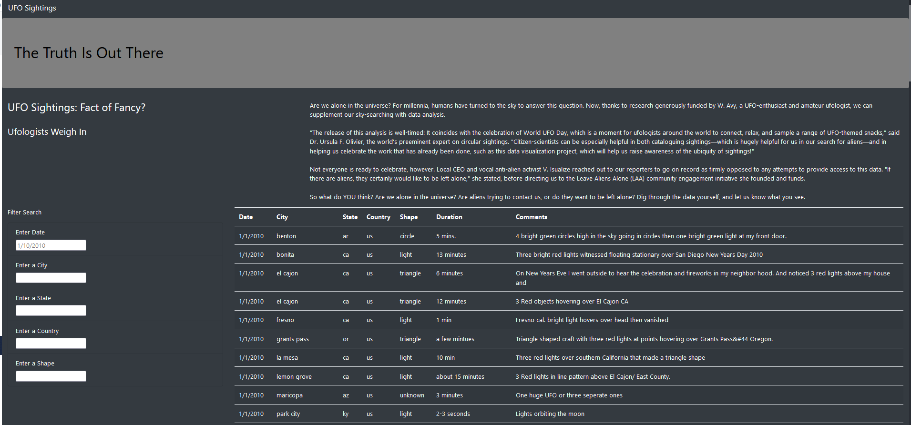
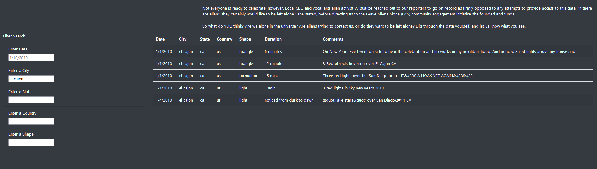

# UFOs
## Project Overview
The UFO web project was created to provied users a page to view sightings.  The page presents known sighting data listed in a table with geographic data and descriptor data for each reported sighting.  In addition, an upgraded feature was to add a filtering ability for users to find sighting data based on geographic elemenets, city,state,country, and other descriptive data such as date or shape of a sighting. The UFO web page has an improved visual with a black background, whit text and table format that is more visually appealing.
## Results
### Web Page Design
The UFO web page design consist of three main components.  First, the page has a header or overview section that allows for an introductory paragraph abou the website.  The second component of the page is a table listing all reportd UFO sightings with date, city, state, country,  shape, duration and comments.  This information is presented in a table format. The third component is a section next to the table for filtering the table to find specific sighting of interest to the user.  The entire page has been formatted with a black background and white text for reability.  A graphic of the web page is shown below.

### Web Page Responsiveness
The page loads quickly and to use the filter boxes the user can type freely in any box and tab or enter to invoke the filter.  The table updates quickly based on user specified filters.  If the user want to remove a filter they need to blank out the selected field and tab or enter to update the table.  A filtered view of the table is shown in the figure below.

## Summary
Overall the web page loads and filters data according to the original design intent.  While it is visually appealing and readability is good, there are several improvements tha can be incorprated in the next revision.
#### Visual and Readability Improvement
First the header and title of the web page should be resized and moved to the center.  It lacks initial appeal.  Some graphics or animation would also help with the inital visual look.  Second the text paragraph should be reduced and captured in some bullets with graphics or other references.  The amount of text is overwhelming and does not add to the appeal of the page.
#### Table Presentation and Filtering
The table should be presented with the abilty to index through sub-pages fo the table instead of endless scrolling.  There are too many records to effectively present on a single page and the user can lose the filter elements while scrolling.  It would also likely be helpful to convert some of the filters to sorting icons at each column so the user could sort on a given column in addition to filtering.  The filters are very basic and a user can enter nonsensical data without a quality check. This needs to be corrected with appropriate guidance on filter content or feedback.  Another nice feature might be to add a "Submit"  and "Clear Filters" buttons to manage the filtering process instead of the current method.  
